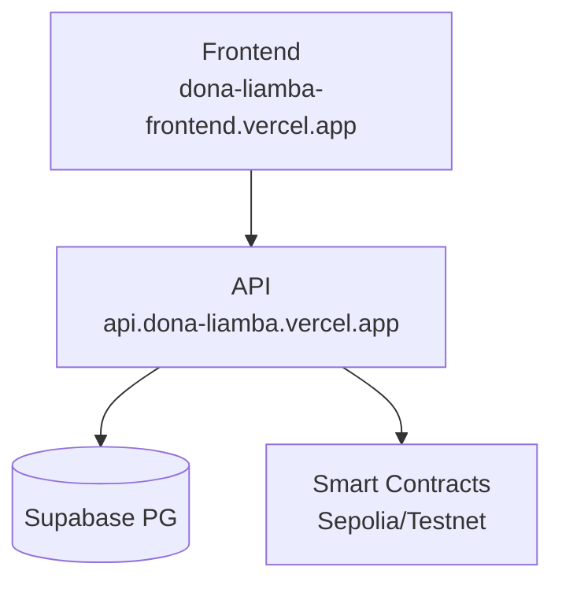

# Dona Liamba Cann Association 🟢

[](https://turbo.build)
[](https://github.com/govinda777/dona-liamba-cann-association/actions)
[](https://vercel.com/new/clone?repository-url=https%3A%2F%2Fgithub.com%2Fgovinda777%2Fdona-liamba-cann-association)

Plataforma canábica conectando pacientes, médicos e associações com governança descentralizada e infraestrutura enterprise.

## 🚀 Stack Técnico

- **Frontend:** Next.js 15 + Tailwind + Turbo
- **Backend:** Next.js API + Prisma + PostgreSQL (Supabase)
- **Contracts:** Hardhat + Ethers.js
- **Infra:** Vercel + GitHub Actions + pnpm
- **Monorepo:** Turborepo + Nx Cloud (cache)

## 🏗️ Arquitetura



## 🚀 Quick Start

```bash
git clone https://github.com/govinda777/dona-liamba-cann-association
pnpm install
pnpm turbo dev  # FE:3000 API:3001 Admin:3002
```

## 📚 Navegação

- [Desenvolvimento Local](docs/development.md)
- [Deploy CI/CD](docs/deployment.md)
- [API Docs](docs/api.md)
- [Smart Contracts](docs/contracts.md)
