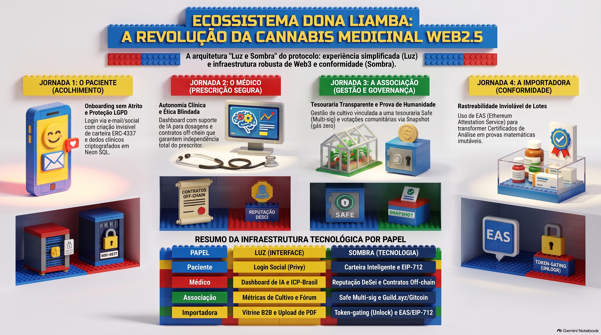

# Dona Liamba Cann Association

  

Uma plataforma Web3 nativa para conectar médicos prescritores, associações e pacientes no ecossistema de cannabis medicinal.

  

[📄 Visualizar Dona Liamba Blueprint (PDF)](docs/Dona_Liamba_Blueprint.pdf)

  

[📄 Visualizar Dona Liamba OS Transparent Motor (PDF)](docs/Dona_Liamba_OS_Transparent_Motor.pdf)

  

[📄 Visualizar Dona_Liamba_OS_Web_2.5_Jornada_(PDF)](docs/Dona_Liamba_OS_Web_2.5_Jornada.pdf)

