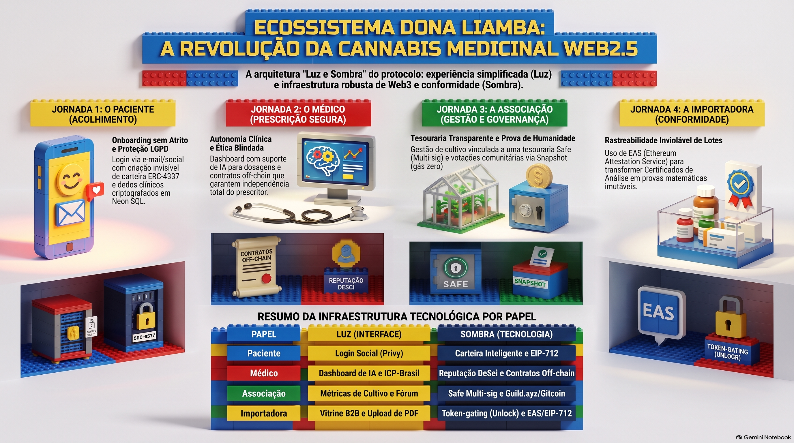

# Dona Liamba Cann Association

<p align="left">
  
</p>


Uma plataforma Web3 nativa para conectar médicos prescritores, associações e pacientes no ecossistema de cannabis medicinal.

<p align="left">
  <a href="https://youtu.be/3XEM4xNwc-o" target="_blank">
    
  </a>
</p>

[📄 Visualizar Dona Liamba Blueprint (PDF)](docs/Dona_Liamba_Blueprint.pdf)

<p align="left">
  <a href="https://youtu.be/9lHpzTSDyCE" target="_blank">
    
  </a>
</p>

[📄 Visualizar Dona Liamba OS Transparent Motor (PDF)](docs/Dona_Liamba_OS_Transparent_Motor.pdf)


<p align="left">
  <a href="https://youtu.be/2kec-L9_RgU" target="_blank">
    
  </a>
</p>

A arquitetura da **Dona Liamba** foi projetada como um **Hub de Medicina Canábica Web2.5 e DAO**, operando sob a lógica de **"Web3 como Cérebro Decisório e Orquestrador, Banco/Pix como Executor"**. Isso significa que a plataforma resolve a complexidade criptográfica para usuários leigos (sem necessidade de comprar cripto, pagar taxas de gás ou gerenciar frases de recuperação), enquanto garante auditoria, imutabilidade e transparência jurídica no ecossistema.

Abaixo está o detalhamento estruturado de como a Dona Liamba funciona como uma **solução compartilhada (Hub)** e, ao mesmo tempo, como um **ambiente especializado para cada um dos 4 atores**: **Pacientes, Médicos, Associações e Importadoras**.

---

### 1. Camada Base Integradora (O Núcleo do Hub)

A plataforma utiliza um **Portal de Onboarding Unificado**, onde todos os usuários se autenticam de forma simples e selecionam seu perfil no protocolo. Essa escolha aciona dinamicamente as permissões, os menus e as ferramentas exclusivas de cada ator:

* **Identidade e Abstração de Conta (Privy SDK em EVM L2 Base):** O login por e-mail ou rede social provisiona de forma transparente uma carteira inteligente (Smart Wallet ERC-4337) patrocinada por Paymaster (gás zero para transações do usuário).
* **Assinaturas Tipadas Off-Chain (EIP-712):** Todos os termos (adesão associativa, TCLE, contratos de prestação e termos de lote) são assinados criptograficamente fora da rede, sem custo de gás.
* **Privacidade e LGPD (Neon SQL):** Nenhum dado pessoal identificável ou prontuário clínico é registrado na blockchain pública. As informações sensíveis ficam protegidas e criptografadas no banco PostgreSQL serverless Neon SQL.
* **Oráculo de Liquidação Pix & Split Bancário:** O agendamento de consultas ou anuidades gera uma cobrança Pix. O middleware (BaaS / Open Finance) monitora a compensação e realiza o *split* financeiro imediato: retém a taxa administrativa da associação no cofre multi-sig Safe e envia os honorários líquidos diretamente para a chave Pix do médico.

---

### 2. Visão Especializada por Ator

```
                                ┌───────────────────────────┐
                                │   PORTAL DE ONBOARDING    │
                                │   (Privy / Social Login)  │
                                └─────────────┬─────────────┘
                                              │
         ┌───────────────────┬────────────────┴───────────────────┬───────────────────┐
         ▼                   ▼                                    ▼                   ▼
  ┌──────────────┐    ┌──────────────┐                     ┌──────────────┐    ┌──────────────┐
  │   PACIENTE   │    │    MÉDICO    │                     │  ASSOCIAÇÃO  │    │ IMPORTADORA  │
  └──────┬───────┘    └──────┬───────┘                     └──────┬───────┘    └──────┬───────┘
         │                   │                                    │                   │
         ├─ Agendamento Pix  ├─ Copiloto IA (SADC)                ├─ Sandbox RDC 1014 ├─ Listing Fees (Unlock)
         ├─ Cofre de Saúde   ├─ CRM + ICP-Brasil                  ├─ Cultivo Seed-to- ├─ Certificados de Lote
         └─ Comitê Gasless   └─ Reputação DeSci (CFM-compliant)   │  Sale (IoT/MQTT)  │  (EAS / EIP-712)
                                                                  └─ Safe Multi-Sig   └─ Dossiê Anvisa
```

#### A. O Paciente (Acolhimento, Linha de Cuidado & Soberania)
* **Jornada Simplificada:** Agendamento rápido de teleconsulta com pagamento instantâneo via Pix.
* **Cofre Pessoal de Saúde:** Repositório criptografado para armazenar receitas de controle especial, laudos médicos e comprovantes de autorização da Anvisa.
* **Acompanhamento e PROs:** Monitoramento de desfechos reportados pelo paciente (PROs), registro diário de dosagem e evolução dos sintomas.
* **Indicação e Afiliados Web3:** Membros que passam por triagem formativa sobre redução de danos e comprovam identidade humana (via Guild.xyz e Gitcoin Passport) liberam links de indicação que geram descontos automáticos na anuidade associativa via webhooks fiduciários.

#### B. O Médico (Independência Clínica, Copiloto de IA & DeSci)
* **Prescrição Eletrônica Legal:** Integração com receita digital assinada via ICP-Brasil, compatível com as exibições para produtos de até 0,2% THC (Receita B1/azul) ou superiores (Receita A3/amarela), atendendo à Portaria 344/98 e RDC 1.015/2026.
* **Copiloto Clínico em IA (SADC):** Sistema de apoio à decisão alimentado por base vetorial (RAG) de literatura e compêndios científicos, sugerindo esquemas de titulação lenta (*start low, go slow*) e emitindo alertas automáticos sobre interações medicamentosas ou contraindicações graves.
* **Conformidade Ética do CFM (Arts. 68 e 69):** A plataforma não cobra anuidade vinculada à permissão de prescrição. O profissional pode aderir a uma anuidade institucional voluntária para participar da comunidade científica e acumula **tokens de reputação não-financeiros (DeSci)** por contribuir com auditorias de dados clínicos anônimos (Real World Data - RWD).

#### C. A Associação (Terceiro Setor, Sandbox RDC 1.014/2026 & Gestão)
* **Enquadramento do Terceiro Setor:** Governança amparada nos Arts. 53 a 61 do Código Civil como Associação Civil sem fins lucrativos, onde todo o superávit financeiro rastreado via Pix retorna 100% à infraestrutura e subsídio social de tratamentos.
* **Sandbox Regulatório Anvisa:** Gestão de indicadores de qualidade, farmacovigilância e controle sanitário exigidos pela RDC 1.014/2026 para operações em pequena escala.
* **Centro de Controle de Operações:** Dashboard de monitoramento de cultivo protegido (telemetria IoT via MQTT), acompanhamento de análises de laboratório e validação cruzada automática de receitas antes do envio dos extratos aos associados.
* **Governança por Código (DAO):** Suprimento fixo e imutável de **100 tokens `$LIAMBA`** para conselheiros, votações *gasless* no **Snapshot** e execução transparente da tesouraria em cofre **Safe multi-sig (2-de-3)** acionado por módulo **Zodiac Reality**.

#### D. A Importadora (Parceiros Comerciais & Rastreabilidade Sanitarista)
* **Catálogo & Listing Fees:** Acesso restrito a formulários de atualização de estoque (*token-gated*) via assinaturas temporais do **Unlock Protocol** em stablecoins ou cartão.
* **Certificados de Análise (CoA) Invioláveis:** Upload de laudos laboratoriais de cromatografia com hash hospedado no Arweave/IPFS e assinado pelo técnico via **EAS (Ethereum Attestation Service)** ou EIP-712 off-chain, garantindo transparência sanitária inviolável.
* **Dossiê Aduaneiro Automatizado:** O sistema monta automaticamente o pacote digital (laudo médico + receita ICP-Brasil + procuração eletrônica do paciente) para envio direto à Anvisa, reduzindo o tempo de desembaraço na alfândega.

---

### 3. Síntese da Stack Tecnológica
* **Autenticação & Wallets:** Privy SDK (Embedded Smart Wallets ERC-4337 na L2 Base).
* **Banco de Dados & LGPD:** Neon SQL (PostgreSQL serverless cifrado) + Sanity CMS.
* **Ponte Fiduciária:** Gateways de Banking-as-a-Service / Open Finance (Pix Dinâmico com Split Automático).
* **Atestações & Acesso:** EAS (Ethereum Attestation Service) + Unlock Protocol + Guild.xyz.
* **Governança DAO:** Foundry (`$LIAMBA` token ERC-20 imutável) + Snapshot + Gnosis Safe + Zodiac Reality.

---
