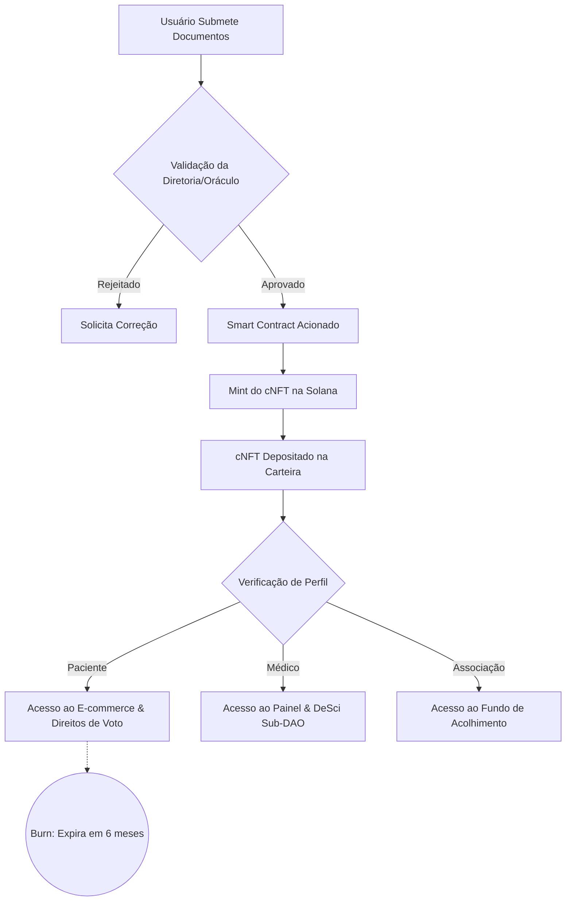
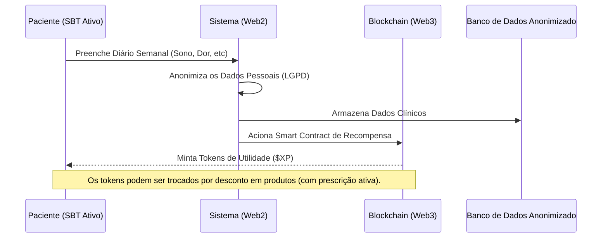
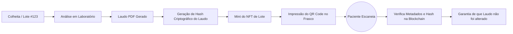

# ADR-003: Casos de Uso Não-Financeiros para Tokens na Iniciativa Dona Liamba

* **Status:** Proposto
* **Data:** 25 de Agosto de 2026
* **Decisores:** Gov, Levi, Ale
* **Contexto Técnico:** O Dona Liamba é um protocolo Web3 de medicina canábica descentralizado e autônomo. A utilização de tokens para além do aspecto financeiro visa mitigar riscos regulatórios (CVM) e resolver dores reais do ecossistema de cannabis no Brasil.

---

## 1. Identidade e Segurança: Soulbound Tokens (SBTs)

Soulbound Tokens são NFTs não-transferíveis. Uma vez na carteira, eles não podem ser vendidos ou enviados para outra pessoa, funcionando como um "passaporte digital" inalterável. Como receitas médicas e registros profissionais não podem ser vendidos ou transferidos, o NFT fica "amarrado" permanentemente à carteira de quem fez o onboarding.

Para estruturar essa arquitetura com eficiência e baixíssimo custo, a emissão dessas credenciais em ecossistemas de alta performance (como a rede Solana, utilizando a tecnologia de cNFTs - Compressed NFTs) permite escalar a base de usuários pagando frações de centavo por credencial, sem onerar a tesouraria.

### 1.1 Perfil: Paciente
O paciente é o centro do ecossistema. O onboarding exige a submissão de um documento de identidade e da receita médica válida (e laudo, se necessário).

* **O fluxo off-chain/on-chain:** Para respeitar a LGPD, os documentos sensíveis ficam armazenados em um gerenciador de conteúdo seguro em nuvem. Uma vez que a diretoria ou o comitê técnico valida os arquivos, o sistema aciona o contrato inteligente que "minta" (emite) o NFT **"Paciente Credenciado"** na carteira do usuário.
* **Poderes do NFT:** A carteira que segura esse NFT ganha acesso liberado ao e-commerce/plataforma para solicitar o medicamento. Ele também habilita a carteira a receber o token de cashback após contribuições e dá direito de voto nas assembleias de *Grants Sociais*.
* **Validade (Burn mechanism):** Como as receitas de Cannabis têm validade legal (geralmente 6 meses), o contrato inteligente pode ser programado para expirar o NFT após esse período. O paciente precisa fazer o upload da nova receita para que o NFT seja renovado, garantindo compliance contínuo com a ANVISA.

### 1.2 Perfil: Médico Prescritor
A classe médica precisa de segurança e dados. O onboarding exige a validação do CRM e, opcionalmente, o certificado de cursos em medicina canabinoide.

* **Poderes do NFT:** O NFT de **"Médico Parceiro"** funciona como uma chave de acesso (Token-Gating) para um painel exclusivo. Com esse NFT, o médico pode visualizar relatórios de telemetria dos lotes (laudos de cromatografia dos produtos), acessar dados anonimizados de eficácia clínica da comunidade e participar de sub-DAOs exclusivas de pesquisa científica (DeSci).
* **Incentivos:** A DAO pode configurar o sistema para que médicos com este NFT recebam recompensas (bounties) ou votos de prestígio sempre que publicarem guias de dosagem ou trouxerem novos pacientes para a associação.

### 1.3 Perfil: Associação (B2B ou Entidade Parceira)
Outras ONGs, clínicas parceiras ou institutos de pesquisa também podem integrar o ecossistema. O onboarding requer validação de CNPJ, Estatuto Social e representantes legais.

* **Poderes do NFT:** O NFT **"Entidade Parceira"** habilita contratos de fornecimento ou pesquisa em maior escala. Por exemplo, uma associação parceira que atende crianças com autismo pode usar esse NFT para acessar o Fundo de Acolhimento da Dona Liamba, solicitando lotes de óleo a preço de custo subsidiado para seus próprios pacientes.
* **Governança Institucional:** Esse perfil pode ter um peso de voto diferenciado para decisões macro da cadeia produtiva, garantindo que as parcerias institucionais tenham voz ativa na direção da DAO.

### 1.4 Dinâmica de Interface e Múltiplos Perfis (Composability)
O front-end do protocolo atua de forma reativa aos SBTs contidos na carteira do usuário (Token-Gated UI), personalizando totalmente a experiência visual:

* **O que cada perfil vê:**
  * **Se a carteira possui apenas o SBT "Paciente":** A interface exibe o E-commerce de acolhimento (foco no tratamento), o Diário de Tratamento DeSci, os NFTs de rastreabilidade (Seed-to-Sale) e as propostas de *Grants Sociais*.
  * **Se a carteira possui apenas o SBT "Médico":** A interface altera o layout (Dashboard Profissional), exibindo o portal de telemetria dos lotes (cromatografia detalhada), acesso às métricas de eficácia clínica anônimas e os fóruns da sub-DAO científica.
  * **Se a carteira possui apenas o SBT "Associação":** O painel se torna B2B, permitindo gerir pedidos em atacado, cadastrar dependentes vinculados ao CNPJ e propor pautas de governança macro.

* **Tratamento de Múltiplos Perfis:** Como a tecnologia descentralizada permite que uma única carteira possua múltiplos SBTs (ex: um Médico que também é Paciente), a UI implementa o conceito de *Composability*.
  * Se a carteira carrega os NFTs "Paciente" **e** "Médico", a interface ativa uma aba superior de "Alternância de Contexto" (Switch Role), onde o usuário escolhe se quer navegar na plataforma no modo Tratamento Pessoal (consumindo) ou no modo Profissional (prescrevendo/analisando), destravando o poder total do protocolo sem necessidade de criar contas separadas.

## 2. Ciência Descentralizada (DeSci) e Recompensa por Dados

O maior gargalo da medicina canábica hoje é a falta de dados clínicos estruturados e longitudinais. A DAO pode usar tokens para incentivar a geração de ciência.

* **Diário de Tratamento Tokenizado:** Pacientes são incentivados a preencher formulários semanais rápidos (ex: relatando qualidade do sono, níveis de dor, efeitos colaterais). Ao enviar o relatório, o sistema (via infraestrutura de baixo custo e alta velocidade) "minta" tokens de utilidade na carteira do paciente.
* **Privacidade e LGPD:** Os dados pessoais ficam em bancos de dados tradicionais ou descentralizados de forma criptografada, enquanto apenas a *prova* de que o paciente contribuiu vai para a rede.
* **Criação de Valor:** Esses dados, devidamente anonimizados, formam um banco de dados valioso para médicos e pesquisadores entenderem quais cepas e dosagens funcionam melhor para cada patologia.

## 3. Rastreabilidade e Transparência: O "NFT de Lote" (Seed-to-Sale)

A confiança no fitoterápico é o ativo mais valioso de uma associação. Tokens podem automatizar e auditar o controle de qualidade.

* **Certificado de Análise On-chain:** Cada lote de cultivo ou extração gera um NFT único. Esse token carrega os metadados do lote e os laudos de laboratório (cromatografia mostrando níveis exatos de CBD, THC, ausência de fungos e metais pesados).
* **O QR Code da Confiança:** O frasco físico que chega à casa do paciente vem com um QR Code. Ao escanear, o paciente abre a página do NFT daquele lote específico, garantindo que o laudo não foi alterado ou forjado em um PDF comum, trazendo uma transparência radical que nem a indústria farmacêutica tradicional oferece hoje.

## 4. Gamificação do Impacto Social (Apadrinhamento)

O brasileiro é solidário, mas muitas vezes desconfia do destino das doações. A DAO pode transformar o financiamento de pacientes hipossuficientes em uma experiência engajadora.

* **Selo de Patrono Social:** Pessoas que doam valores (via Pix) para o Fundo de Acolhimento recebem NFTs dinâmicos que evoluem conforme o impacto delas aumenta (ex: "Patrono Nível 1" a "Guardião da Comunidade").
* **Rastreio do Impacto:** O doador consegue ver, por meio do sistema da DAO, que a sua doação em Reais foi convertida no subsídio exato de *X* frascos para pacientes na fila de espera, unindo o recibo Pix ao registro on-chain de distribuição do remédio.

## 5. Acesso Token-Gated

Tokens podem funcionar como "chaves" digitais para destrancar espaços educacionais e ferramentas.

* Acesso exclusivo a painéis online, grupos fechados ou fóruns onde médicos discutem casos clínicos.
* Poder de prioridade: Se um lote especial (ex: uma genética rara voltada para uma patologia específica) for colhido em quantidade limitada, a DAO pode programar para que pacientes com maior tempo de associação (comprovado pelo token) tenham preferência na reserva.
